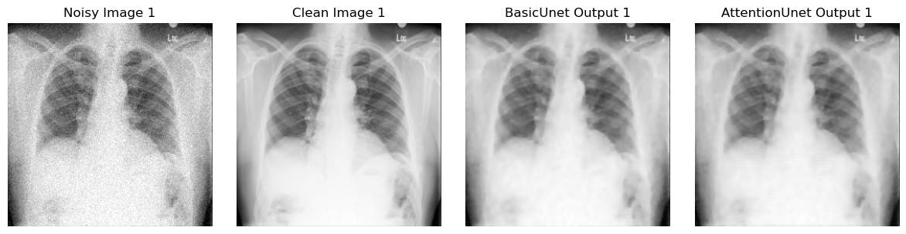
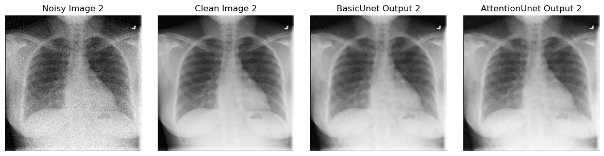
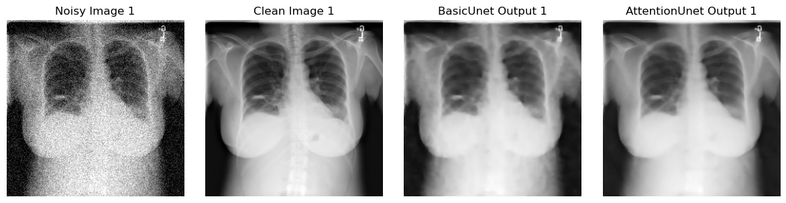
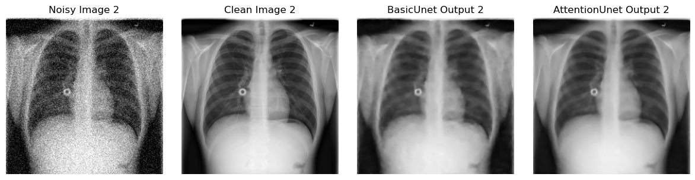
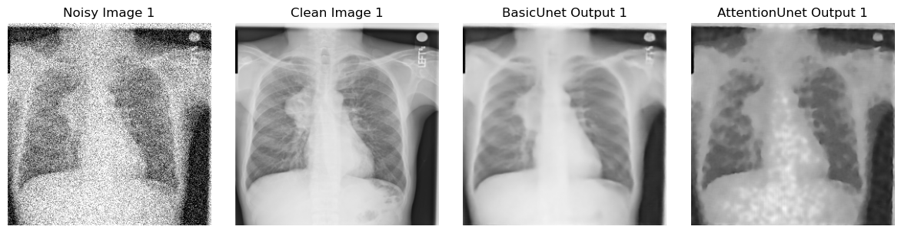
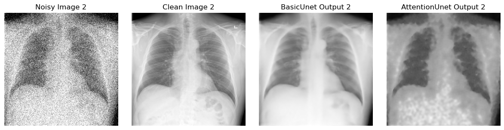

<h1 align="center">Results</h1>

This mini project experiments with using different gaussian noise intensities for comparing denoising performance across two different Unet variants. 
A standard Unet and a Dual Attention based Unet architecture.

### 1. Quantitative Results

#### Final Test Metrics per Model

| Model-Noise        | SSIM   | PSNR | MSE      | MAE    |
|--------------------|--------|------|----------|--------|
| Unet-0.05          | 0.924  | 36.1 | 0.000245 | 0.0120 |
| UnetAttention-0.05 | 0.8984 | 35.0 | 0.000317 | 0.0139 |
| Unet-0.1           | 0.887  | 33.3 | 0.000468 | 0.0163 |
| UnetAttention-0.1  | 0.888  | 33.4 | 0.000455 | 0.0160 |
| Unet-0.15          | 0.882  | 32.7 | 0.000541 | 0.0178 |
| UnetAttention-0.15 | 0.843  | 31.0 | 0.000791 | 0.0213 |

<strong>Table 1:</strong> Final test metrics for each model across Gaussian noise levels (σ = 0.05, 0.1, 0.15).

### 2. Visual Results

#### Sample Output Comparison (σ = 0.05)
 
 

#### Sample Output Comparison (σ = 0.1)
 
 

#### Sample Output Comparison (σ = 0.15)

 
 

### 3. Summary
The standard Unet architecture performed better than using residual Dual Attention mechanisms on the 
skip connections. The SSIM and PSNR were higher and the MSE and MAE were notably lower for on average for all trials and produced minimal artifacts compared
to the attention implementation. Visually, the base Unet performed best at 0.05 and 0.15 noise levels, and comparable within error to the 0.1 noise level. The attention unet introduced artifacts into the denoised images at 0.15, which indicates overfitting. 
Generally, this basic experimentation showed that either there was a lack of regularization or that the selected attention mechanism was not correct for this task.

### 4. Changes/Errors
As a result of basic experimentation/first imaging project, there were a couple of errors introduced into the process that should be avoided for future training these are: 
1. Use of Gaussian Noise, Poisson Noise is more realistic for Xray Imaging. 
2. Lack of Regularization, MSE Loss alone was a poor design decision, especially when working with more complex architectures. 
3. No early stopping was implemented into the final training loop, which could have led to overfitting and was a mistake overlooked on my part.